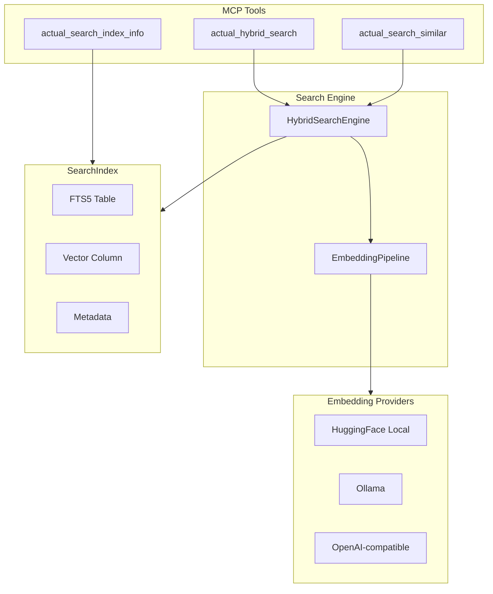
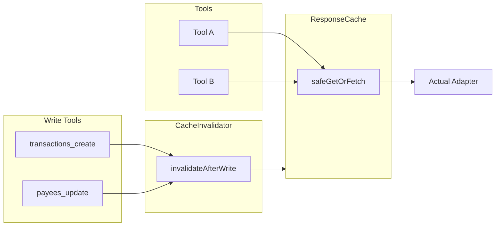

# Architecture

**Project:** Actual MCP Server  
**Version:** 0.4.7  
**Last Updated:** 2025-11-11

---

## Table of Contents

- [System Architecture](#system-architecture)
- [Component Overview](#component-overview)
- [Data Flow](#data-flow)
- [Module Structure](#module-structure)
- [Execution Lifecycle](#execution-lifecycle)
- [Configuration](#configuration)
- [Transport Protocols](#transport-protocols)
- [Error Handling](#error-handling)
- [Performance & Reliability](#performance--reliability)
- [Search Module](#search-module)
- [Caching Layer](#caching-layer)

---

## System Architecture

### High-Level Diagram

```
┌─────────────────┐         ┌──────────────────┐         ┌─────────────────┐
│                 │   MCP   │                  │  REST   │                 │
│  MCP Client     │◄────────┤  Actual MCP      │◄────────┤  Actual Budget  │
│  (LibreChat)    │         │  Server          │         │  Server         │
│                 │         │                  │         │                 │
└─────────────────┘         └──────────────────┘         └─────────────────┘
                                     │
                                     │ SQLite
                                     ▼
                            ┌─────────────────┐
                            │   Local Cache   │
                            │  (Budget Data)  │
                            └─────────────────┘
```

### Component Layers

```
┌───────────────────────────────────────────────────────────┐
│              Client Layer (LibreChat, etc.)               │
└───────────────────────────────────────────────────────────┘
                            │
                   HTTP / WebSocket / SSE
                            ▼
┌───────────────────────────────────────────────────────────┐
│               Transport Layer                             │
│  ┌──────────┐  ┌──────────┐  ┌──────────┐               │
│  │   HTTP   │  │   WSS    │  │   SSE    │               │
│  │ Server   │  │  Server  │  │  Server  │               │
│  └──────────┘  └──────────┘  └──────────┘               │
└───────────────────────────────────────────────────────────┘
                            │
                       MCP Protocol
                            ▼
┌───────────────────────────────────────────────────────────┐
│            MCP Protocol Layer                             │
│  ┌────────────────────────────────────────────────────┐  │
│  │         ActualMCPConnection                        │  │
│  │  (Request routing, response handling)              │  │
│  └────────────────────────────────────────────────────┘  │
└───────────────────────────────────────────────────────────┘
                            │
                        Tool Calls
                            ▼
┌───────────────────────────────────────────────────────────┐
│            Business Logic Layer                           │
│  ┌────────────────────────────────────────────────────┐  │
│  │         ActualToolsManager                         │  │
│  │  (Tool registry, validation, dispatch)             │  │
│  └────────────────────────────────────────────────────┘  │
│                                                           │
│  ┌─────┐  ┌─────┐  ┌─────┐  ┌─────┐  ┌─────┐           │
│  │Tool1│  │Tool2│  │Tool3│  │ ... │  │ 42  │           │
│  └─────┘  └─────┘  └─────┘  └─────┘  └─────┘           │
└───────────────────────────────────────────────────────────┘
                            │
                      Adapter Functions
                            ▼
┌───────────────────────────────────────────────────────────┐
│              Data Access Layer                            │
│  ┌────────────────────────────────────────────────────┐  │
│  │         Actual Adapter                             │  │
│  │  (Retry logic, concurrency control, error mapping)│  │
│  └────────────────────────────────────────────────────┘  │
└───────────────────────────────────────────────────────────┘
                            │
                      @actual-app/api
                            ▼
┌───────────────────────────────────────────────────────────┐
│            External API Layer                             │
│  ┌────────────────────────────────────────────────────┐  │
│  │         Actual Budget API Client                   │  │
│  │  (Official @actual-app/api package)                │  │
│  └────────────────────────────────────────────────────┘  │
└───────────────────────────────────────────────────────────┘
                            │
                    REST API / SQLite
                            ▼
┌───────────────────────────────────────────────────────────┐
│                Actual Budget Server                       │
│                    (External Service)                     │
└───────────────────────────────────────────────────────────┘
```

---

## Component Overview

### Core Modules

| Module | File | Responsibility | Key Functions |
|--------|------|----------------|---------------|
| **Main Entry** | `src/index.ts` | Orchestration, CLI parsing, server startup | `main()` |
| **Connection Manager** | `src/actualConnection.ts` | Actual Budget API lifecycle | `connectToActual()`, `shutdownActual()` |
| **Tool Manager** | `src/actualToolsManager.ts` | Tool registry and dispatch | `registerTools()`, `callTool()` |
| **Session Worker Manager** | `src/lib/SessionWorkerManager.ts` | Per-session worker lifecycle, write coordination | `createSession()`, `executeTool()` |
| **Write Coordinator** | `src/lib/WriteCoordinator.ts` | Actor-style write serialization (entity keys) | `acquire()` |
| **MCP Connection** | `src/lib/ActualMCPConnection.ts` | MCP protocol implementation | `handleToolCall()`, `handleRequest()` |
| **Adapter Layer** | `src/lib/actual-adapter.ts` | API wrapper with error handling | All Actual API functions |
| **Configuration** | `src/config.ts` | Environment validation | `config`, `configSchema` |
| **Logger** | `src/logger.ts` | Structured logging | `logger` singleton |
| **Observability** | `src/observability.ts` | Metrics collection | `incrementToolCall()`, `getMetricsText()` |

### Transport Implementations

| Transport | File | Status | Authentication | LibreChat Support |
|-----------|------|--------|----------------|-------------------|
| **HTTP** | `src/server/httpServer.ts` | ✅ Production | Bearer token | ✅ Fully supported |
| **SSE** | `src/server/sseServer.ts` | ✅ Production | Bearer token* | ⚠️ Headers not sent |
| **WebSocket** | `src/server/wsServer.ts` | ✅ Production | Bearer token | ❌ Not supported |

*SSE authentication works server-side but LibreChat client doesn't send custom headers

### Tool Definitions

52 tools organized by category:

```
src/tools/
├── accounts_create.ts
├── accounts_list.ts
├── accounts_update.ts
├── accounts_delete.ts
├── accounts_close.ts
├── accounts_reopen.ts
├── accounts_get_balance.ts
├── transactions_create.ts
├── transactions_get.ts
├── transactions_update.ts
├── transactions_delete.ts
├── transactions_import.ts
├── transactions_filter.ts
├── budgets_getMonth.ts
├── budgets_getMonths.ts
├── budgets_get_all.ts
├── budgets_setAmount.ts
├── budgets_transfer.ts
├── budgets_setCarryover.ts
├── budgets_holdForNextMonth.ts
├── budgets_resetHold.ts
├── budgets_batch_updates.ts
├── categories_get.ts
├── categories_create.ts
├── categories_update.ts
├── categories_delete.ts
├── category_groups_get.ts
├── category_groups_create.ts
├── category_groups_update.ts
├── category_groups_delete.ts
├── payees_get.ts
├── payees_create.ts
├── payees_update.ts
├── payees_delete.ts
├── payees_merge.ts
├── payee_rules_get.ts
├── rules_get.ts
├── rules_create.ts
├── rules_update.ts
├── rules_delete.ts
├── query_run.ts
├── bank_sync.ts
├── hybrid_search.ts         # Hybrid FTS5 + vector + RRF retrieval
├── search_similar.ts        # Vector similarity search (N most similar)
├── search_index_info.ts    # Index stats + embedding provider info
└── index.ts (exports all tools)
```

---

## Data Flow

### Request Flow

```
1. Client sends MCP request
   │
   ├──> HTTP POST /http
   ├──> WebSocket message
   └──> SSE connection + POST
   │
2. Transport layer receives request
   │
   └──> Parses JSON-RPC 2.0 format
   │
3. ActualMCPConnection routes request
   │
   ├──> tools/list → Returns 2 meta-tools (Progressive Disclosure)
   │    └──> actual_tool_registry: discover all internal tools
   │    └──> actual_tool_call: dispatch to any internal tool
   ├──> tools/call → Routes to SessionWorkerManager
   └──> Other MCP methods
   │
4. Progressive Disclosure dispatch:
   │
   ├──> actual_tool_registry → queries ActualToolsManager for full catalog
   └──> actual_tool_call → validates toolName, delegates to SessionWorkerManager
   │
5. ActualToolsManager validates and calls tool
   │
   ├──> Validates tool name exists
   ├──> Validates input schema (Zod)
   └──> Calls tool implementation function
   │
5. Tool calls Actual Adapter function
   │
   └──> Adapter applies retry logic & concurrency control
   │
6. @actual-app/api makes REST call
   │
   └──> Actual Budget Server processes request
   │
7. Response flows back up the stack
   │
   └──> JSON result or error returned to client
```

### Tool Call Example

```typescript
// Client request (MCP format)
{
  "jsonrpc": "2.0",
  "id": 1,
  "method": "tools/call",
  "params": {
    "name": "actual_transactions_create",
    "arguments": {
      "accountId": "uuid-123",
      "date": "2025-11-11",
      "amount": -5000,
      "payee": "Amazon"
    }
  }
}

// Server processing
ActualMCPConnection.handleToolCall()
  └─> ActualToolsManager.callTool("actual_transactions_create", args)
      └─> transactionsCreate(args) in src/tools/transactions_create.ts
          └─> actualAdapter.addTransaction(args) in src/lib/actual-adapter.ts
              └─> api.addTransaction(args) from @actual-app/api
                  └─> REST POST to Actual Budget Server

// Server response
{
  "jsonrpc": "2.0",
  "id": 1,
  "result": {
    "content": [{
      "type": "text",
      "text": "Transaction ID: uuid-456"
    }]
  }
}
```

---

## Module Structure

### Project Layout

```
actual-mcp-server/
├── src/                          # TypeScript source code
│   ├── index.ts                  # Main entry point
│   ├── config.ts                 # Environment validation (Zod)
│   ├── logger.ts                 # Winston logger singleton
│   ├── observability.ts          # Prometheus metrics
│   ├── actualConnection.ts       # Actual API connection manager
│   ├── actualToolsManager.ts     # Tool registry singleton
│   ├── utils.ts                  # Utility functions
│   ├── tests_adapter_runner.ts   # Adapter test executor
│   │
│   ├── lib/                      # Core libraries
│   │   ├── actual-adapter.ts     # Actual API wrapper
│   │   ├── ActualMCPConnection.ts # MCP protocol handler
│   │   ├── cachedRefs.ts         # Centralized ref-data cache (accounts, payees, etc.)
│   │   ├── retry.ts              # Retry logic utilities
│   │   └── search/               # Search & caching module
│   │       ├── index.ts          # Public exports
│   │       ├── types.ts          # Search/cache types
│   │       ├── ResponseCache.ts  # LRU cache + SWR + tag invalidation
│   │       ├── CacheInvalidator.ts
│   │       ├── syncState.ts      # Search index dirty flag
│   │       ├── SearchIndex.ts   # libsql-backed index + FTS5 + vectors
│   │       ├── HybridSearchEngine.ts
│   │       ├── EmbeddingPipeline.ts
│   │       └── providers/
│   │           ├── types.ts, factory.ts, index.ts
│   │           ├── HuggingFaceLocalProvider.ts
│   │           ├── OllamaProvider.ts
│   │           └── OpenAICompatibleProvider.ts
│   │
│   ├── server/                   # Transport implementations
│   │   ├── httpServer.ts         # HTTP transport (recommended)
│   │   ├── sseServer.ts          # Server-Sent Events
│   │   ├── wsServer.ts           # WebSocket transport
│   │   └── streamable-http.d.ts  # Type definitions
│   │
│   ├── tools/                    # MCP tool definitions (42 files)
│   │   ├── accounts_*.ts         # 7 account tools
│   │   ├── transactions_*.ts     # 6 transaction tools
│   │   ├── budgets_*.ts          # 8 budget tools
│   │   ├── categories_*.ts       # 4 category tools
│   │   ├── category_groups_*.ts  # 4 category group tools
│   │   ├── payees_*.ts           # 6 payee tools
│   │   ├── rules_*.ts            # 4 rule tools
│   │   ├── query_run.ts          # Advanced ActualQL queries
│   │   ├── bank_sync.ts          # Bank synchronization
│   │   └── index.ts              # Tool exports
│   │
│   ├── types/                    # TypeScript type definitions
│   │   └── tool.d.ts             # MCP tool types
│   │
│   ├── prompts/                  # MCP prompt templates
│   │   └── showLargeTransactions.ts
│   │
│   └── resources/                # MCP resources
│       └── accountsSummary.ts
│
├── test/                         # Tests and scripts
│   ├── e2e/                      # End-to-end tests (Playwright)
│   ├── integration/              # Integration tests
│   ├── unit/                     # Unit tests
│   └── docker-actual-test/       # Docker test setup
│
├── scripts/                      # Build and utility scripts
│   ├── generate-tools.ts         # Tool generator from OpenAPI
│   ├── verify-tools.js           # Tool coverage verification
│   └── openapi/                  # OpenAPI specifications
│
├── docs/                         # Documentation (this folder)
├── generated/                    # Generated TypeScript types
├── actual-data/                  # Budget data cache (gitignored)
├── logs/                         # Application logs (gitignored)
│
├── Dockerfile                    # Production container
├── docker-compose.prod.yml       # Production Docker Compose
├── package.json                  # Dependencies and scripts
├── tsconfig.json                 # TypeScript configuration
└── .env.example                  # Environment variable template
```

---

## Execution Lifecycle

### Startup Sequence

```
1. CLI Argument Parsing
   └─> src/index.ts parses --help, --debug, --ws, --sse, --http
   └─> --help exits early (before loading environment)

2. Environment Loading
   └─> dotenv loads .env file
   └─> src/config.ts validates with Zod schema
   └─> Exits with error if validation fails

3. Dynamic Imports
   └─> Lazy load all dependencies (winston, @actual-app/api, etc.)
   └─> Improves cold start performance

4. Actual Budget Connection
   └─> src/actualConnection.ts::connectToActual()
   └─> api.init({ dataDir, serverURL, password })
   └─> api.downloadBudget(syncId, { password })
   └─> Budget data cached to MCP_BRIDGE_DATA_DIR

5. Tool Registry Initialization
   └─> src/actualToolsManager.ts loads all tools
   └─> Validates tool schemas
   └─> Registers 52 tools with MCP capabilities

6. MCP Connection Setup
   └─> Create ActualMCPConnection instance
   └─> Build capabilities object (tools, resources, prompts)

7. Transport Server Startup
   └─> Start HTTP / SSE / WebSocket server
   └─> Bind to MCP_BRIDGE_PORT
   └─> Register health endpoints

8. Ready State
   └─> Log "🚀 Actual MCP Server v0.1.0"
   └─> Accept MCP requests
```

### Shutdown Sequence

```
1. SIGINT / SIGTERM received
   │
2. Graceful shutdown initiated
   ├─> Close transport server (HTTP/SSE/WS)
   ├─> Stop accepting new requests
   ├─> Wait for pending requests (timeout: 10s)
   │
3. Actual Budget disconnection
   └─> src/actualConnection.ts::shutdownActual()
   └─> api.shutdown() - closes DB connections
   │
4. Logger flush
   └─> Winston flushes remaining log entries
   │
5. Process exit
   └─> Exit code 0 (clean shutdown)
```

### Test Modes

The server supports special test modes:

```bash
# Test Actual Budget connection only
npm run dev -- --test-actual-connection
  └─> Connects, downloads budget, disconnects, exits

# Test all tool implementations
npm run dev -- --test-actual-tools
  └─> Runs smoke tests for all 52 tools

# Test MCP client interaction
npm run dev -- --http --test-mcp-client
  └─> Starts server, sends test requests, verifies responses
```

---

## Configuration

### Environment Variables

All configuration via environment variables. See `.env.example` for complete reference.

#### Required Variables

```bash
# Actual Budget connection
ACTUAL_SERVER_URL=http://localhost:5006
ACTUAL_PASSWORD=your_password
ACTUAL_BUDGET_SYNC_ID=your_sync_id
```

#### Server Configuration

```bash
# Server settings
MCP_BRIDGE_PORT=3600                    # Server port
MCP_BRIDGE_DATA_DIR=./actual-data       # Budget cache directory
MCP_BRIDGE_BIND_HOST=0.0.0.0            # Bind address

# Transport mode (Docker only)
MCP_TRANSPORT_MODE=--http               # --http or --sse
```

#### Security

```bash
# Authentication
MCP_SSE_AUTHORIZATION=your_bearer_token  # Bearer token (optional)

# HTTPS
MCP_ENABLE_HTTPS=true                    # Enable TLS
MCP_HTTPS_CERT=/app/certs/cert.pem       # Certificate path
MCP_HTTPS_KEY=/app/certs/key.pem         # Private key path
```

#### Logging

```bash
# Log configuration
MCP_BRIDGE_STORE_LOGS=false              # Write to disk
MCP_BRIDGE_LOG_DIR=./logs                # Log directory
MCP_BRIDGE_LOG_LEVEL=info                # error, warn, info, debug
```

#### Testing

```bash
# Test flags
SKIP_BUDGET_DOWNLOAD=false               # Skip budget sync on startup
DEBUG=true                                # Enable debug logging
```

### Configuration Schema

Validated by Zod schema in `src/config.ts`:

```typescript
export const configSchema = z.object({
  ACTUAL_SERVER_URL: z.string().url(),
  ACTUAL_PASSWORD: z.string().min(1),
  ACTUAL_BUDGET_SYNC_ID: z.string().min(1),
  MCP_BRIDGE_DATA_DIR: z.string().default('./actual-data'),
  MCP_BRIDGE_PORT: z.string().default('3000'),
  MCP_TRANSPORT_MODE: z.enum(['--http', '--sse']).default('--http'),
  MCP_SSE_AUTHORIZATION: z.string().optional(),
  MCP_ENABLE_HTTPS: z.string().optional().transform(val => val === 'true'),
  MCP_HTTPS_CERT: z.string().optional(),
  MCP_HTTPS_KEY: z.string().optional(),
});
```

---

## Transport Protocols

### HTTP Transport (Recommended)

**Type**: `streamable-http` from `@modelcontextprotocol/sdk`

**Endpoints**:
- `POST /http` - MCP requests
- `GET /health` - Health check
- `GET /metrics` - Prometheus metrics

**Authentication**: Bearer token in `Authorization` header

**LibreChat Status**: ✅ Fully supported and verified

**Configuration**:
```bash
# Start HTTP server
npm run dev -- --http

# Docker (default)
docker run -e MCP_TRANSPORT_MODE=--http ...
```

**LibreChat Config**:
```yaml
mcpServers:
  actual-mcp:
    type: "streamable-http"
    url: "https://your-server:3600/http"
    headers:
      Authorization: "Bearer your_token"
    serverInstructions: true
```

### SSE Transport

**Type**: Server-Sent Events

**Endpoints**:
- `GET /sse` - Event stream
- `POST /sse` - Send messages

**Authentication**: Bearer token (server-side only)

**LibreChat Status**: ⚠️ Client doesn't send auth headers

**Use Case**: Development without authentication

### WebSocket Transport

**Type**: Full-duplex WebSocket

**Endpoint**: `ws://your-server:3600`

**Authentication**: Bearer token in initial handshake

**LibreChat Status**: ❌ Not supported

**Use Case**: Custom MCP clients

---

## Error Handling

### Error Flow

```
Tool Error
  └─> Caught by tool implementation
      └─> Adapter layer retry logic (3 attempts)
          └─> If all retries fail → Error response
              └─> ActualMCPConnection formats error
                  └─> Transport sends JSON-RPC error

Error Response Format:
{
  "jsonrpc": "2.0",
  "id": 1,
  "error": {
    "code": -32000,
    "message": "Tool execution failed: ..."
  }
}
```

### Retry Logic

Implemented in `src/lib/actual-adapter.ts`:

```typescript
// Exponential backoff retry
maxRetries: 3
baseDelay: 1000ms
backoff: exponential (1s, 2s, 4s)
```

### Concurrency Control

```typescript
// Prevent overwhelming Actual Budget server
maxConcurrentRequests: 5
queueDelay: 100ms between requests
```

---

## Performance & Reliability

### Optimization Strategies

1. **Connection Pooling**: Single persistent connection to Actual Budget
2. **Local Caching**: Budget data cached to SQLite (MCP_BRIDGE_DATA_DIR)
3. **Lazy Loading**: Dynamic imports for faster cold starts
4. **Retry Logic**: Automatic recovery from transient failures
5. **Session Isolation**: Dedicated worker per session to enable parallel tool execution

### Monitoring

- **Health Endpoint**: `/health` returns `{"status":"ok","initialized":true}`
- **Metrics Endpoint**: `/metrics` exposes Prometheus metrics
- **Structured Logging**: Winston with daily rotation

### Reliability Features

- **Graceful Shutdown**: SIGTERM/SIGINT handlers
- **Error Boundaries**: All tool calls wrapped in try/catch
- **Input Validation**: Zod schemas for all tool inputs
- **Type Safety**: Full TypeScript with strict mode

---

## Technology Stack & Dependencies

### Core Dependencies

**Production Runtime:**
- **@actual-app/api** (^25.11.0): Official Actual Budget API client
  - Purpose: Core integration with Actual Budget server
  - License: MIT
  - Status: ✅ Current, actively maintained

- **@modelcontextprotocol/sdk** (^1.18.2): Model Context Protocol SDK
  - Purpose: MCP protocol implementation
  - License: MIT
  - Status: 🔄 Update available (1.22.0)
  - Action: Scheduled for minor update

- **express** (^4.21.2): Web server framework
  - Purpose: HTTP/SSE transport layer
  - License: MIT
  - Status: ✅ Current (Express v5 available but deferred)
  - Note: Major v5 migration planned for Q1 2026

- **winston** (^3.18.3): Logging framework
  - Purpose: Structured logging with daily rotation
  - License: MIT
  - Status: ✅ Current

- **axios** (^1.12.2): HTTP client
  - Purpose: External API calls
  - License: MIT
  - Status: 🔄 Update available (1.13.2)

**Development Tools:**
- **TypeScript** (^5.9.2): Type-safe development
- **@playwright/test** (^1.56.0): E2E testing framework
- **ts-node** (^10.9.1): TypeScript execution

### Dependency Management

**Automated Monitoring:**
- **Dependabot**: Weekly security scans, auto-PRs for updates
- **Renovate Bot**: Intelligent update grouping, auto-merge for low-risk patches
- **CI/CD**: Automated testing on dependency changes

**Security Posture:**
- ✅ 0 known vulnerabilities (as of 2025-11-24)
- ✅ 306 total dependencies (207 production, 99 dev)
- ✅ All packages actively maintained
- ✅ Permissive licenses only (MIT, Apache-2.0, ISC, BSD)

**Update Strategy:**
- **Patch updates** (x.x.X): Auto-merge weekly after CI passes
- **Minor updates** (x.X.x): Manual review for production deps
- **Major updates** (X.x.x): Dedicated migration sprint with breaking change analysis

**Monitoring:**
- Weekly dependency audits (Mondays 9 AM UTC)
- Automated security vulnerability alerts
- Dependency dashboard in GitHub Issues
- Full audit report: `docs/DEPENDENCY_AUDIT_REPORT.md`

**Pending Updates (as of 2025-11-24):**
1. Batch patch updates (6 packages): Ready for auto-merge
2. MCP SDK (1.18.2 → 1.22.0): Scheduled for minor update
3. Express v5 migration: Deferred to Q1 2026 (requires 8-16 hour migration)

### Third-Party Integrations

**Actual Budget Server:**
- REST API integration via @actual-app/api
- Local SQLite cache for performance
- Automatic sync on startup

**LibreChat / MCP Clients:**
- HTTP transport (recommended)
- Server-Sent Events (SSE) for streaming
- WebSocket (deprecated, legacy support)

**Monitoring & Observability:**
- Prometheus metrics (`/metrics` endpoint)
- Winston structured logging
- Health checks (`/health` endpoint)

---

## Search Module

The search module provides hybrid transaction retrieval: **FTS5 BM25 + vector cosine similarity + metadata filtering + Reciprocal Rank Fusion (RRF)**. It runs in-process using libsql (Turso's SQLite fork) for storage.

### Architecture Overview



### Key Components

| Component | Responsibility |
|-----------|----------------|
| **SearchIndex** | libsql-backed index with FTS5 virtual table (self-contained, not external content) and `F32_BLOB` vector columns. Incremental sync via `content_hash` per row to skip unchanged transactions. |
| **HybridSearchEngine** | Orchestrates FTS5 BM25 + vector ANN + metadata filters; merges results via RRF. |
| **EmbeddingPipeline** | Batches text, embeds via provider, stores vectors. |
| **Provider factory** | Fallback chain: configured provider → local HuggingFace → null (FTS-only mode). |

### Embedding Providers

| Provider | Package | Use Case |
|----------|---------|----------|
| **HuggingFace Local** | `@huggingface/transformers` | Zero-config local embeddings |
| **Ollama** | `ollama` | Local Ollama models |
| **OpenAI-compatible** | `openai` | Remote API (OpenAI, Together, etc.) |

**Graceful degradation:** If embeddings are unavailable, hybrid/vector search auto-downgrades to fulltext-only (FTS5).

### File Structure

```
src/lib/search/
├── index.ts              # Public exports (getSearchEngine, safeGetOrFetch, etc.)
├── types.ts              # SearchResult, CacheTag, etc.
├── ResponseCache.ts      # LRU + TTL + tag invalidation + SWR
├── CacheInvalidator.ts   # Tool → tag mapping
├── syncState.ts          # markSearchIndexDirty / isSearchIndexDirty
├── SearchIndex.ts        # libsql index with FTS5 + vectors
├── HybridSearchEngine.ts # RRF merge logic
├── EmbeddingPipeline.ts  # Batch embedding
└── providers/
    ├── types.ts, factory.ts, index.ts
    ├── HuggingFaceLocalProvider.ts
    ├── OllamaProvider.ts
    └── OpenAICompatibleProvider.ts

src/lib/cachedRefs.ts     # getCachedAccounts, getCachedPayees, etc.

src/tools/
├── hybrid_search.ts      # actual_hybrid_search
├── search_similar.ts     # actual_search_similar
└── search_index_info.ts  # actual_search_index_info
```

### New Search Tools (3)

| Tool | Description |
|------|-------------|
| **actual_hybrid_search** | Hybrid retrieval: FTS5 BM25 + vector cosine + metadata filters + RRF |
| **actual_search_similar** | Find N most similar transactions by vector cosine distance |
| **actual_search_index_info** | Expose index stats (doc count, sync state) and embedding provider info |

---

## Caching Layer

### ResponseCache

In-memory LRU cache (`lru-cache` v11) with:

- **TTL** per entry
- **Tag-based invalidation** — write tools invalidate by tag (e.g. `transactions`, `search`)
- **Stale-while-revalidate (SWR)** — serve stale value immediately, revalidate in background
- **Concurrent request coalescing** — duplicate in-flight requests share a single fetch

### CacheInvalidator

Maps write tool names to cache tags. Called after every successful write:

```typescript
invalidateAfterWrite('actual_transactions_create');
// → invalidates tags: ['transactions', 'search']
// → marks search index dirty for next search
```

### safeGetOrFetch

Wrapper around `ResponseCache.getOrFetch` that catches cache infrastructure failures and falls through to direct API calls. Used by tools that need cached reference data.

### cachedRefs.ts

Centralized reference data caching with 10 min TTL:

| Function | Tag | Fetcher |
|----------|-----|---------|
| `getCachedAccounts()` | `accounts` | `adapter.getAccounts()` |
| `getCachedPayees()` | `payees` | `adapter.getPayees()` |
| `getCachedCategories()` | `categories` | `adapter.getCategories()` |
| `getCachedCategoryGroups()` | `categories` | `adapter.getCategoryGroups()` |

Convention: cache keys use `ref:` prefix. Convenience builders (`getAccountMap`, `getPayeeMap`, etc.) avoid rebuilding maps on every call.



---

## Next Steps

For more details:
- [Dependency Audit Report](./DEPENDENCY_AUDIT_REPORT.md) - Complete dependency analysis
- [Testing & Reliability](./TESTING_AND_RELIABILITY.md) - Testing strategy
- [Security & Privacy](./SECURITY_AND_PRIVACY.md) - Security policies (including dependency security)
- [Refactoring Plan](./REFACTORING_PLAN.md) - Dependency update roadmap
- [AI Interaction Guide](./AI_INTERACTION_GUIDE.md) - AI agent rules
